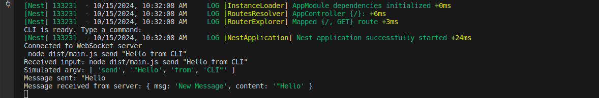

# NestJS CLI WebSocket Client

This project is a command-line interface (CLI) application built using NestJS that connects to a WebSocket server. It allows users to send messages to the server and receive real-time updates.

## Table of Contents

- [Features](#features)
- [Prerequisites](#prerequisites)
- [Installation](#installation)
- [Usage](#usage)
- [Commands](#commands)
- [Contributing](#contributing)
- [License](#license)

## Features

- Connects to a WebSocket server.
- Sends messages to the server using CLI commands.
- Receives and logs messages from the server in real-time.

## Prerequisites

- Node.js (v20.x or later)
- NestJS CLI
- A WebSocket server running (e.g., another NestJS application)

## Installation

1. Clone the repository:

   ```bash
   git clone https://github.com/yourusername/your-repo-name.git
   cd your-repo-name
   ```

2. Install the dependencies:

   ```bash
   npm install
   ```

## Usage

1. Start the WebSocket server (if not already running):

   ```bash
   # Navigate to your WebSocket server directory
   cd path/to/websocket/server
   npm run start
   ```

2. Start the CLI application:

   ```bash
   npm run start
   ```

3. Once the CLI is ready, you can type commands as described below.

## Demo

Server


client


## Commands

### `send <message>`

Sends a message to the WebSocket server.

**Example:**

```bash
send "Hello from CLI"
```

### `exit`

Exits the CLI application.

**Example:**

```bash
exit
```

## Contributing

Contributions are welcome! If you have suggestions for improvements or new features, please open an issue or submit a pull request.

1. Fork the project.
2. Create your feature branch (`git checkout -b feature/AmazingFeature`).
3. Commit your changes (`git commit -m 'Add some AmazingFeature'`).
4. Push to the branch (`git push origin feature/AmazingFeature`).
5. Open a pull request.

## License

This project is licensed under the MIT License - see the [LICENSE](LICENSE) file for details.
